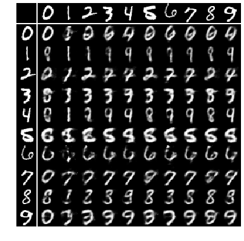
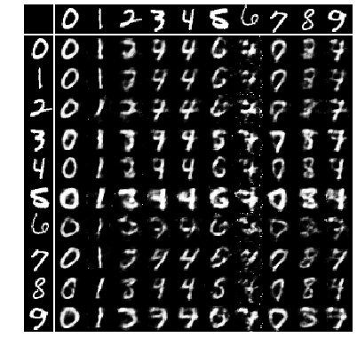
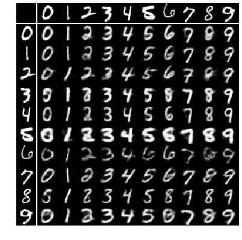
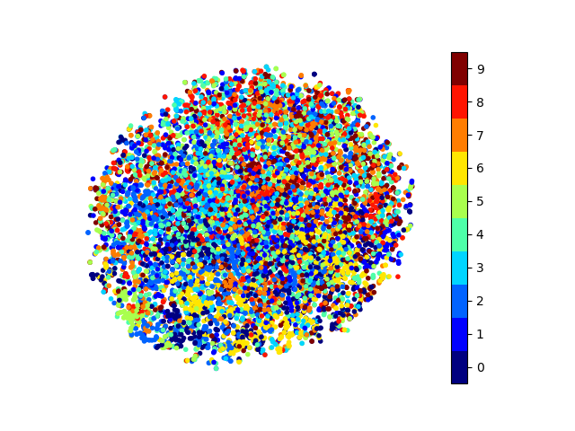
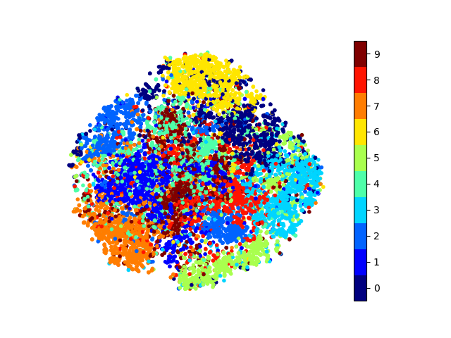
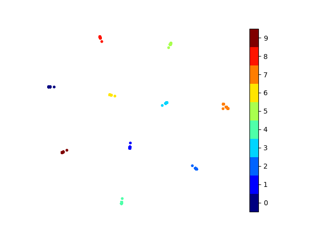
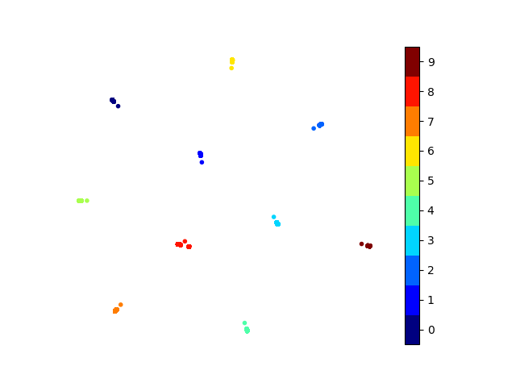
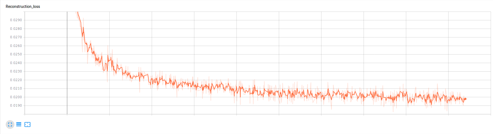
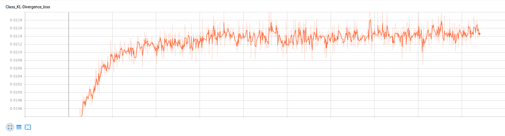
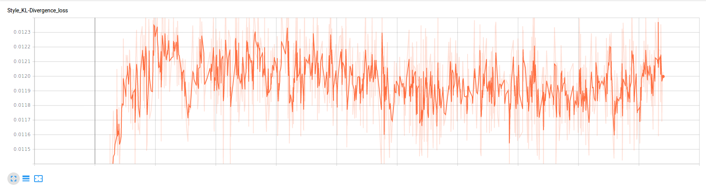

# multi-level-vae

This repository contains the code for the paper:  Multi-Level Variational Autoencoder (https://arxiv.org/abs/1705.08841), which was accepted at AAAI-18.
This paper proposes a non-adversarial approach to disentangle factors of variation based on group-level supervision.

This repository provides files necessary to train this architecture on MNIST dataset, while it can be generalised to other datasets
in the paper by changing the **data_loader** and **networks** files.

The code has been tested with the following python interpreter and library versions:

 - python 3.6.3
 - pytorch 0.4.0
 - torchvision 0.2.1
 - argparse 1.1
 - numpy 1.13.3
 - matplotlib 2.2.2
 - tensorboardX 1.2

## Some of the things which helped us in training the network and reproducing results

- A bigger batch size helped accumulate more class evidence while training.

- Initially, when we divided the latent space into 2 codes (class and style), accumulated evidence in the class space
and reparameterized each sample within the mini-batch separately, we noticed that the decoder preferred to ignore information from
the class space altogether while reconstructing images from swapped embeddings. To help reconstruct images better, the encoder also chose to
encode structure into the style latent space, something which is not desirable while disentangling style and class. (running the setup
for 2000 epochs as mentioned in the paper also did not help)

- To prevent a degenerate solution (ignoring of class latent space), we experimented with using the mu, computed from the evidence
accumulation equation in the class space, as a deterministic node and completely ignored the log-variance. This worked and the results
no longer showed a degenerate solution.

- Since we were able to generate valid images using a single mu value (after class evidence accumulation) for each sample
belonging to the same group, we then decided to reparameterize in a way where only 1 random variable was sampled per group from
the standard normal distribution and used to reparameterize the mu and std of each group before passing on as the class latent embeddings
to the decoder.

- Again, this produced a degenerate solution. We then decided to sample the variable used to reparameterize from a Gaussian distribution
with mu=0 and std=0.1. Using these values, we were able to reproduce the results of the paper.

- Further experiments are needed to check if the architecture is robust towards the selection of dimensionality of the latent spaces.

In summary, we found that the decoder can choose to ignore input from class latent space quite easily (even with the slightest increase
in randomness of the inputs) and the proposed architecture can surely benefit from a loss function introduced specifically to make the
decoder utilise the provided class embeddings.

## Results

### Image generation by swapping class and style embeddings

Generating good images from swapped representations requires accumulating class evidence from test images.

Test images from the training procedure where a standard normal was used to sample the variable used in the reparameterization equation.
Left image grid is generated without accumulating class evidence, while the right image grid is generated after accumulating class evidence.

Adding evidence in the class space does not change the two images significantly, thus corroborating the obvious visual observation that
the class latent space is being ignored.

<table style="width:100%">
    <tr>
        <td align="center"></td>
        <td align="center"></td>
    </tr>
</table>

Test images from the training procedure where a Gaussian distribution with mu=0 and std=0.1 was used to sample the variable used in the
reparameterization equation. Left image grid is generated without accumulating class evidence, while the right image grid is generated
after accumulating class evidence.

<table style="width:100%">
    <tr>
        <td align="center"></td>
        <td align="center"></td>
    </tr>
</table>

### Classification results on latent spaces

As is evident from the experiments, classification accuracy on the class latent space decreases considerably without accumulating evidence
on test images.

<table style="width:100%">
  <tr>
    <th>Distribution for reparam variable</th>
    <th>Style dim</th>
    <th>Class dim</th>
    <th>Evidence accumulation</th>
    <th>Style train acc.</th>
    <th>Style test acc.</th>
    <th>Class train acc.</th>
    <th>Class test acc.</th>
  </tr>
  <tr>
    <td>standard normal</td>
    <td>10</td>
    <td>10</td>
    <td>Yes</td>
    <td>78.66</td>
    <td>78.17</td>
    <td>85.93</td>
    <td>85.99</td>
  </tr>
  <tr>
    <td>standard normal</td>
    <td>10</td>
    <td>10</td>
    <td>No</td>
    <td>78.69</td>
    <td>77.82</td>
    <td>33.26</td>
    <td>33.08</td>
  </tr>
  <tr>
    <td>Gaussian with mu=0, std=0.1</td>
    <td>10</td>
    <td>10</td>
    <td>Yes</td>
    <td>44.61</td>
    <td>42.06</td>
    <td>99.75</td>
    <td>99.71</td>
  </tr>
  <tr>
    <td>Gaussian with mu=0, std=0.1</td>
    <td>10</td>
    <td>10</td>
    <td>No</td>
    <td>44.38</td>
    <td>42.99</td>
    <td>37.74</td>
    <td>38.55</td>
  </tr>
</table>

### t-SNE plot of latent spaces

t-SNE plots for style latent space. Image on the left shows the plot for the training procedure where a Gaussian distribution with
mu=0 and std=0.1 was used to sample the variable used in the reparameterization equation. Image on the right shows the plot for the
training procedure where the standard normal distribution was used.

As it can be seen, there is quite a bit of structure present in the style latent space on the right, supporting the results of image generation
and classification from above where the images are just taking information from the style latent space.

<table style="width:100%">
    <tr>
        <td align="center"></td>
        <td align="center"></td>
    </tr>
</table>

t-SNE plots for class latent space (after evidence accumulation). Image on the left shows the plot for the training procedure where a Gaussian distribution with
mu=0 and std=0.1 was used to sample the variable used in the reparameterization equation. Image on the right shows the plot for the
training procedure where the standard normal distribution was used.

<table style="width:100%">
    <tr>
        <td align="center"></td>
        <td align="center"></td>
    </tr>
</table>

### Graphs of loss function

Finally, I also include the graphs of loss functions from 'tensorboard'.

Reconstruction loss

<table style="width:100%">
    <tr>
        <td align="center"></td>
    </tr>
</table>

Class latent space KL-divergence loss

<table style="width:100%">
    <tr>
        <td align="center"></td>
    </tr>
</table>

Style latent space KL-divergence loss

<table style="width:100%">
    <tr>
        <td align="center"></td>
    </tr>
</table>
